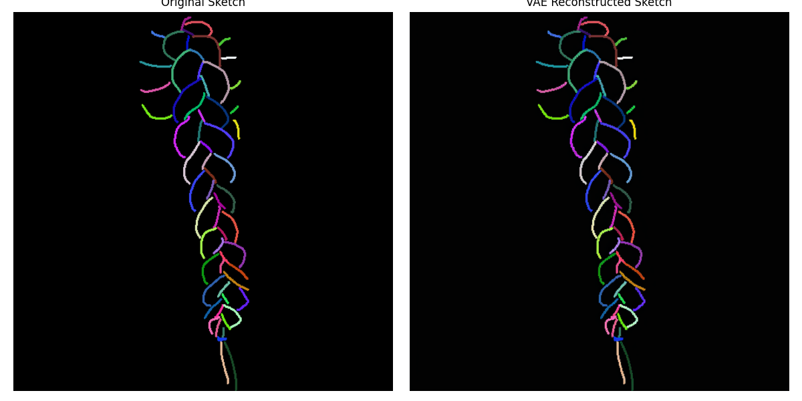
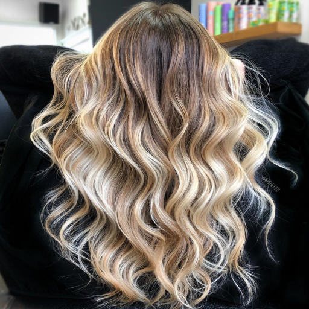
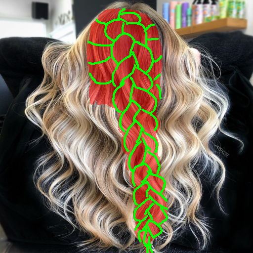
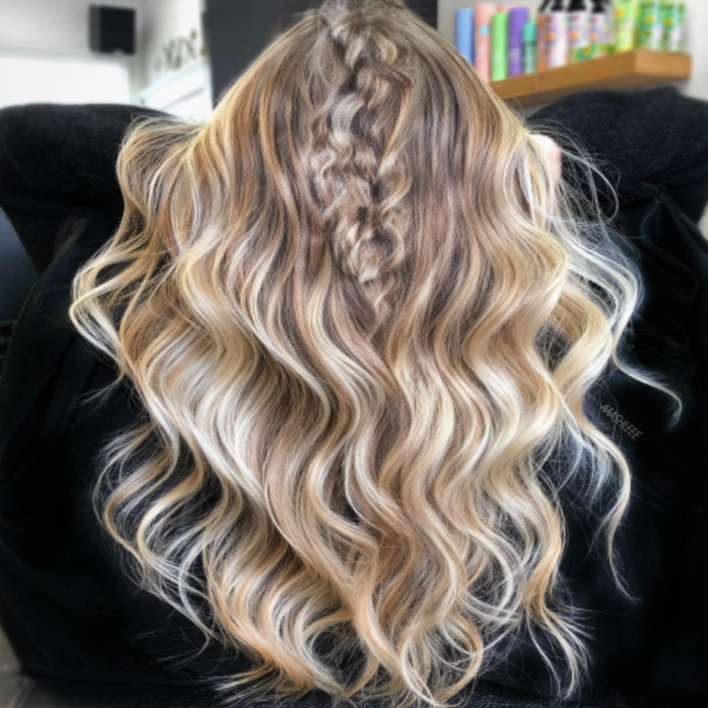
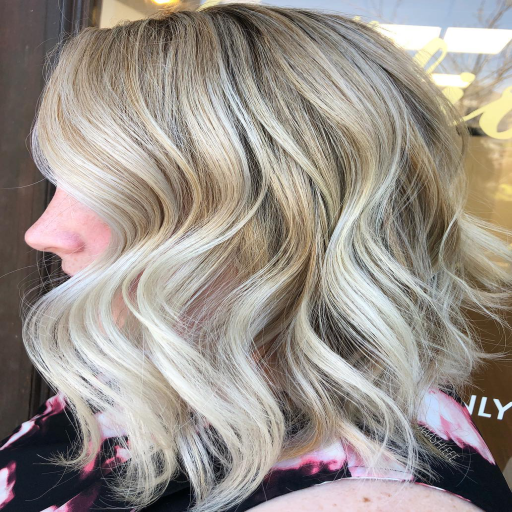
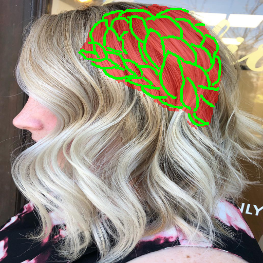
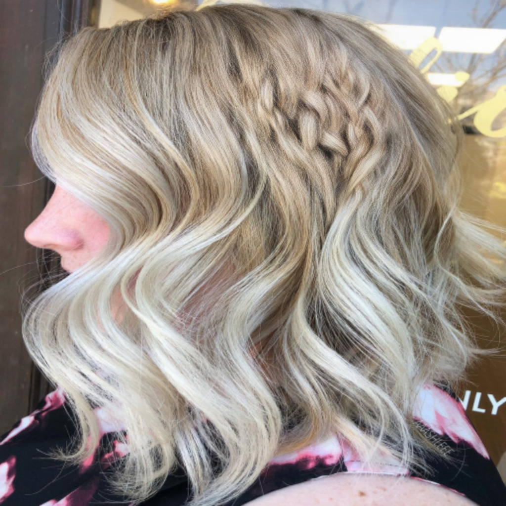
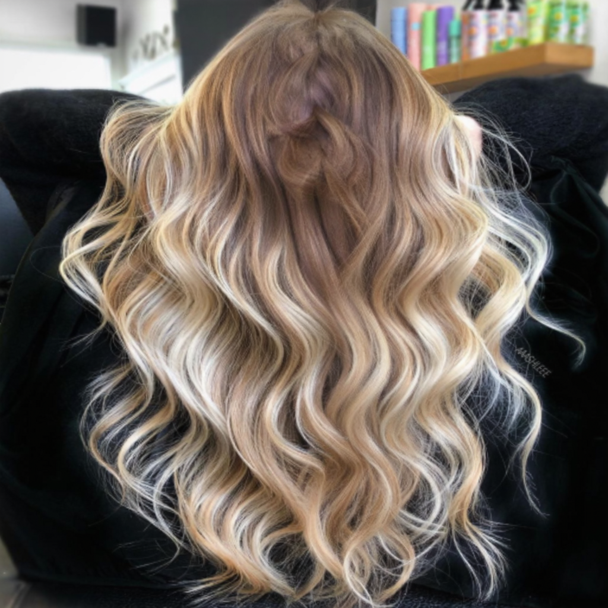
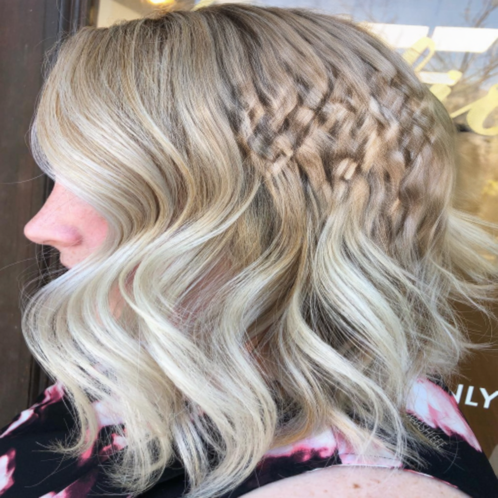

# 시도해본 두 가지 학습방식

## 0. VAE 복원 테스트

 VAE 복원은 정상 . 문제는 **손실 함수(Loss)**

## 1. 손실 함수 (Loss Function) 차이

### Sobel Gradient Loss

*   **원리:** `GradientLoss` 클래스를 사용하여 이미지에 Sobel 필터(x, y축)를 씌운 뒤, 1차 미분값 즉 윤곽선(엣지)을 추출합니다. 이 윤곽선 간의 L1 오차를 최소화하는 효과.

| 원본 사진 | 스케치 | 정렬 | 결과  |
| :---: | :---: | :---: | :---: |
|  |  | |  |
|  |  | |  |

*   **장점:** Sobel 필터는 고주파 성분(얇은 선, 질감)을 강하게 잡아냅니다. 따라서 모델이 원본 스케치의 세밀한 땋은 선을 무시하지 못하고 강제로 따라가게 만듭니다.
*   **단점:** 볼륨감이 뭉개지는 경향이 있음.

### Gaussian Shape Loss 기반 -> 기존 논문에서 제시된 방법
*   **원리:** `ShapeLoss` 클래스를 사용하여 예측값과 정답에 아주 강한 **가우시안 블러($\sigma=10.0$)**를 먹인 뒤, 그 뭉개진 덩어리(Volume) 간의 L1 오차를 최소화합니다.

| 원본 사진 | 스케치 | 정렬 | 결과  |
| :---: | :---: | :---: | :---: |
|  |  | |  |
|  |  | |  |

*   **장점:** 전체적인 머리의 실루엣이나 부피감을 따라가는 능력이 탁월합니다.
*   **단점:** 얇은 땋은 선(고주파) 오차가 블러로 인해 모두 뭉개짐. 따라서 모델은 스케치의 선을 무시하고 자신의 학습된 머리로 마음대로 채우게 됩니다. **(현재 스케치를 무시하는 가장 큰 이유)**

### GAN에서는 충분했는데 SD 3.5에서는 안 통하는 이유 분석
SketchHairSalon은 GAN구조를 사용 

GAN 구조에서는 Generator가 뭉개진 Shape Loss만 보고 형태를 그릴 때,  **Discriminator와 Perceptual Loss**가 "진짜 머리카락 사진의 고주파 질감(Texture)과 디테일"을 강제로 학습하도록 유도하였음

하지만 SD3.5 구조에서는 판별자나 Perceptual Loss가 부재함

오직 "MSE(노이즈 예측 오차) + 뭉개진 Shape Loss" 두 가지만 존재합니다. SD 3.5는 텍스처를 스스로 알아서 그리는 능력이 있음(강력한 Prior). 따라서 얇은 선(고주파) 오차가 Shape Loss에서 블러로 깎여나가 증발해버리면, SD 3.5는
얇은 선은 무시하고 학습된 머리결로 채워넣으며 스케치 선을 무시해 버리는 것입니다.

---

## 2. 생성된 체크 포인트 사용 전략

### A. 앙상블
두 체크포인트는 동일한 SD 3.5 베이스에서 출발하여 각각 고주파(디테일)와 저주파(볼륨) 방향으로 파인튜닝된 상태.  따라서 이 두 모델의 weight 를 SLERP(Spherical Linear Interpolation)로 5:5 Merge 

*   **기대 효과:** 모델 파라미터 앙상블 스무딩 효과를 통해 볼륨감과 얇은 선 디테일을 둘 다 잡을 수 있음.
*   **한계점:** 기존의 두 체크포인트 모두 LPIPS 기반으로 훈련되지 않았습니다. 단순 파라미터 앙상블은 모델이 '이미 배운 것'을 섞을 뿐이므로, 앙상블만으로는 땋은 결 패턴을 구조적으로 흉내내는 LPIPS의 능력은 만들어낼 수 없습니다. 오직 위치 강건성과 선 긋기 능력의 결합만 일어납니다.

### B. Fine-tuning (Hybrid Loss)
*   **시작점:** Gaussian Loss 체크포인트를 기본 모델로 불러옵니다.
*   **Fine-tuning:** 이 모델 위에 Hybrid Loss (Multi-scale Sobel + LPIPS)를 적용하여 학습을 재개. 

*   **이유:** 신경망은 저주파를 먼저 배우고 고주파를 나중에 배우는 성질이 있습니다(Spectral Bias). 따라서 Gaussian 모델에게 Multi-scale Sobel 패널티를 주면, 모델의 기존 지식을 깨지 않고 디테일만 살릴 수 있음. 

## 3. 참고 : 원본 논문(SketchHairSalon)의 최종 손실 함수

원본 논문이 디테일한 선을 잃지 않고 머리털을 생성할 수 있었던 비결은 여러 Loss를 하이브리드로 사용하였기 때문입니다. 논문의 2단계(S2I-Net: 스케치 $\to$ 실제 형태) 최종 손실 식은 다음과 같습니다. 

$$L_{S2I} = \lambda_1 L_1 + \lambda_{adv} L_{cGAN} + \lambda_{per} L_{per} + \lambda_{shape} L_{shape}$$

1.  $L_1$ : 픽셀 단위 일치(Pixel-wise Loss)
2.  $L_{cGAN}$ : 적대적 훈련을 통한 고주파/디테일 보강 (Discriminator)
3.  $L_{per}$ : VGG 네트워크를 통한 텍스처/스타일 일치 (Perceptual Loss)
4.  $L_{shape}$ : 가우시안 블러($\sigma=10.0$)를 씌워 전체 덩어리/실루엣을 맞춤 (저주파 보강)

**결론:** 결과적으로 원본 논문은 $L_{cGAN}$과 $L_{per}$라는 제약 조건을 통해 국소적인 고주파 영역을 강건하게 보존하는 동시에, 파라미터 $\sigma=10.0$의 Gaussian Blur가 적용된 $L_{shape}$을 통해 저주파 영역의 전반적인 구조와 부피감을 안정적으로 유지해냄. 이는 얇은 엣지의 특징 선택(Feature Selection)과 전체적인 매끄러운 가중치 분산 효과를 동시에 취하는 **상호 보완적인 하이브리드 손실(Hybrid Loss) 모델링 매커니즘**이다.

### GAN loss 식과 Fine-tuning 시 SD 3.5 loss 식 비교

|    분류    |    GAN 기반    |    SD 3.5 기반    |    설명    |
| :---: | :---: | :---: | :--- |
| **기본 생성 성능** | $L_1$ | **$L_{MSE}$** | • **기본 원리:** 기존 GAN은 이미지 픽셀 간의 L1 Loss를 계산했지만, Diffusion 모델 구조에 맞춰 노이즈 예측 오차인 MSE Loss로 대체함. |
| **전체적인 형태** | $L_{shape}$ | **$L_{shape}$ (Gaussian Blur)** | • **동일 적용:** 기존 논문과 동일하게 $\sigma=10.0$ 수준의 강한 가우시안 블러를 적용함. 전체적인 머리 실루엣과 볼륨감을 학습시켜 augmentation으로 인한 위치 변화에도 강건 하게 대응함. |
| **디테일한 땋은 선** | $L_{cGAN}$ | **$L_{gradient}$ (Multi-scale Sobel)** | • **대체 기법:** SD 모델에는 Discriminator가 없기 때문에 얇은 선이 뭉개지는 현상이 발생함. 이를 해결하기 위해 여러 커널 크기(3x3, 5x5 등)의 Sobel 필터로 엣지를 추출하여 세밀한 디테일 손실을 방지함. |
| **질감 및 스타일** | $L_{per}$ (VGG) | **$L_{LPIPS}$** | • **기능 보완:** 단순한 픽셀 매칭만으로는 '땋은 머리' 특유의 텍스처 패턴을 살리기 어려움. 따라서 사전 학습된 LPIPS를 도입해, 모델의 기본 Prior(생머리 등)를 억제하고 스케치와 유사한 질감을 확정적으로 생성하도록 유도함. |

### 기하학적 증강
*   회전($\pm15^\circ$), 이동($\pm10\%$), 좌우 반전을 Target, Mask, Sketch 이미지 3장에 완벽히 동기화하여 동일하게 적용합니다.
*   덕분에 모델이 스케치의 위치 변화나 구도 변화에 매우 튼튼하게 대응할 수 있습니다.

---

**결론:** 
1. 두 체크포인트의 가중치를 0.5:0.5로 Merge한 뒤 추론테스트를 돌려 완성도를 확인(A)
2. Gaussian 체크포인트를 베이스 모델로 삼고 Hybrid Loss 체제로 추가 학습(B) 진행.
