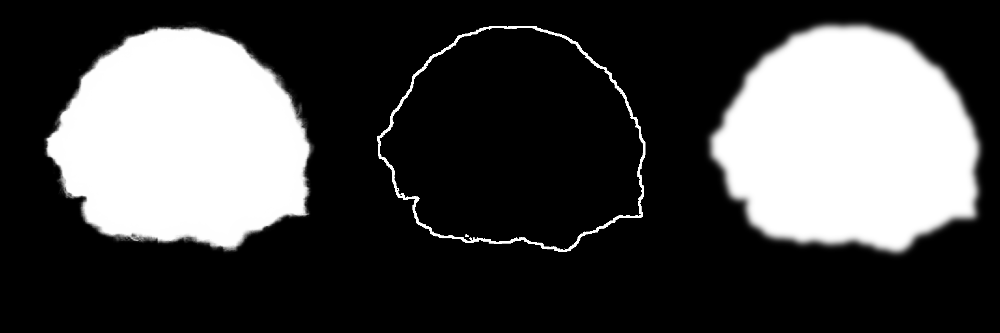

# SD3.5 헤어 생성 파이프라인

본 문서는 Stable Diffusion 3.5 Large 모델을 기반으로 한 스케치 기반 헤어 생성 모델의 아키텍처, 학습 원리, 및 운영 방식을 기술합니다.

## 1. 개요 
- **목표**: 스케치(Sketch)를 입력받아 실사 같은 머리카락(Hair)을 생성하는 모델 개발.
- **기반 모델**: `stabilityai/stable-diffusion-3.5-large` (80억 파라미터).
- **제어 전략**:
    - **형태(Structure)**: 사전 학습된 Canny ControlNet 사용.
    - **질감/디테일(Texture)**: 독자 데이터셋으로 미세 조정(Fine-tuning)된 **LoRA 어댑터** 사용.

---

## 2. 학습 구성 요소 요약

| 구성 요소 | 모델 종류 | 상태 | 설명 |
| :--- | :--- | :--- | :--- |
| **Transformer (SD3.5)** | MM-DiT Large (8B) | ❄️ **Frozen** | 모델의 지식(본체)은 건드리지 않음 |
| **LoRA Adapter** | Peft / Low-Rank Adaptation | 🔥 **Train** | `to_k, to_q, to_v, to_out` 레이어만 학습 |
| **ControlNet** | Canny ControlNet (SD3.5) | ❄️ **Frozen** | 스케치를 해석하는 능력은 이미 배운 거 씀 |
| **VAE** | AutoencoderKL | ❄️ **Frozen** | 이미지를 압축/복원하는 기능만 사용 |
| **Text Encoder (CLIP/T5)** | (Not Loaded) | ❌ **Unused** | 메모리 절약을 위해 더미(Dummy) 값으로 대체 |

---

## 3. 핵심 아키텍처 (Architecture Components)

### A. SD3.5 Transformer (with LoRA)
- **역할**: 이미지 생성의 Backbone Network (Diffusion Transformer).
- **학습 방식**: 전체 파라미터를 학습하는 대신, **Parameter-Efficient Fine-Tuning (PEFT)** 기법인 **LoRA**를 적용하여 연산 효율성 극대화.
- **타겟 모듈**: `to_k, to_q, to_v, to_out` (Self/Cross Attention Layer의 Projection Matrices).

### B. ControlNet (Frozen - 얼림)
- **모델**: `stabilityai/stable-diffusion-3.5-large-controlnet-canny`.
- **역할**: 입력된 스케치를 해석하여 전체적인 "형태 가이드"를 제공합니다.
- **선정 이유**: 우리의 입력 데이터인 "스케치(선 그림)"는 컴퓨터가 보는 Canny Edge(외곽선) 맵과 의미적으로 완벽하게 일치합니다. 따라서 별도의 학습은 필요하지 않음.

### C. 텍스트 인코더 (Dummy)
- **역할**: 보통은 프롬프트(글자)를 이해하는 역할입니다.
- **학습 전략**: **사용 안 함 (Dummy 값 전달)**.
    - 무거운 T5/CLIP 인코더 대신 **"0으로 채워진 빈 텐서"**를 입력으로 넣습니다.
    - **이유 1**: 텍스트 인코더만 10GB 이상의 메모리를 차지하므로 이를 제거하여 학습 효율을 높입니다.
    - **이유 2**: 모델이 텍스트에 의존하지 않고, 오직 **스케치(ControlNet)와 마스크 영역**만 보고 그림을 그리도록 강제합니다.
    - **주의사항**: 텍스트 인코더는 꺼도 되지만, **`pooled_projections` (압축된 텍스트 벡터)**는 반드시 `dummy` 값이라도 전달해야 합니다. SD3 ControlNet이 **시간(Timestep) 정보를 계산할 때 이 벡터를 필수적으로 참조**하기 때문입니다.

---

## 3. 학습 과정: Masked Diffusion

### 데이터셋 구조 (`dataset/braid`)
| 폴더명 | 내용물 | 역할 |
|:---:|:---:|:---:|
| `img/` | 원본 사진 (RGB) | 정답지 (Ground Truth) |
| `matte/` | 헤어 마스크 (Binary, 흑백) | 학습범위 |
| `sketch/` | 컬러/선 스케치 | 입력 조건 |

#### 데이터 예시 (Data Example: `braid_1.png`)
| **Image (Target)** | **Matte (Mask)** | **Sketch (Input)** |
|:---:|:---:|:---:|
|  |  |  |

### 학습 루프 상세
1.  **입력 처리**:
    - **Latents ($z_0$)**: 원본 이미지를 VAE로 압축한 잠재 표현.
    - **Noisy Latents ($z_t$)**: 여기에 랜덤 노이즈를 섞어 이미지를 망가뜨립니다.
    - **Condition**: 스케치 이미지를 **VAE로 인코딩하여(16채널 Latent)** ControlNet에 입력합니다. (단순 RGB 입력은 안됨)
    - **Mask**: 마스크 이미지를 Latent 크기로 줄입니다.

2.  **모델 예측**:
    - 모델은 `망가진 이미지` + `스케치 정보` + `빈 텍스트`를 받습니다.
    - 모델의 임무는 노이즈를 제거하여 원래 이미지를 복구하는 것(Noise Prediction / Flow Matching)입니다.

3.  **마스크드 손실 계산**:
    - Global Loss 대신 Spatial Masking을 적용하여 관심 영역(ROI)에 대한 Loss만을 선별적으로 계산.
    - **수식 (Normalized Masked Loss)**:
      $$ L = \frac{\sum (\| \mathbf{v}_{pred} - \mathbf{v}_{gt} \|^2 \odot \mathbf{M}_{hair})}{\sum \mathbf{M}_{hair} + \epsilon} $$
    - **효과**: Non-Hair Region(얼굴, 배경)에 대한 Gradient Backpropagation을 차단하여, 모델의 최적화 방향을 온전히 Hair Texture Reconstruction에 집중시킴.

---

## 4. 추론 전략 (Inference Strategy - 학습 후)
학습이 끝난 후 `inference_sd3_5.py`를 실행할 때의 동작:
1.  **LoRA 로드**: 우리가 가르친 "머리카락 질감 노하우"를 장착합니다.
2.  **텍스트 인코더 ON**: 학습 때는 껐지만, 추론 때는 켭니다. (예: "Red hair", "Blonde hair" 등 색상 조절을 위해)
3.  **최종 결과 합성**:
    - **형태**: 스케치를 따라감 (ControlNet 담당).
    - **질감**: 실사 같은 머릿결 (LoRA 담당).
    - **색상**: 프롬프트 명령어 (Text Encoder 담당).
    - **주의**: **스케치의 색상은 무시됩니다.** ControlNet은 스케치를 "흑백 선(Structure)"으로만 인식합니다. 빨간색 펜으로 그렸다고 빨간 머리가 나오지 않습니다. 머리 색깔은 텍스트 프롬프트("Red hair")로 지정해야 합니다.

## 5. 심화 기술: 왜 Reference Attention인가?
우리는 단순 인페인팅(Inpainting) 대신 **Reference Attention** 기법을 최종 목표로 합니다.

| 기술 | 방식 | 단점 |
| :--- | :--- | :--- |
| **Simple Inpainting** | 구멍난 부분(Mask)을 주변 픽셀을 보고 메꿈 | 얼굴과 머리카락 경계가 어색할 수 있음. 전신 조명/맥락을 놓칠 수 있음. |
| **Reference Attention** | **원본 이미지를 계속 참조하면서** 머리카락을 그림 | 경계선이 사라지고 자연스러움을 기대. |

*   **핵심 이유**: 헤어스타일 변경은 얼굴과의 조화가 핵심. Reference Attention은 생성된 머리카락이 **"원본 얼굴의 조명과 피부톤"을 실시간으로 참고**하게 만들어, 합성 티가 나지 않는 결과를 만듭니다.

---

## 6. 컬러 스케치 처리 전략: 이원화 (Dual Path Processing)

사용자가 **"알록달록한 땋은 머리"** 스케치를 입력했을 때, 모델은 이를 두 가지 경로로 나누어 처리합니다.

### 1️⃣ 경로 1: 형태 (Shape by ControlNet)
- **입력**: Canny Edge Detector를 통과한 **흑백 선 이미지**.
- **역할**: "색깔은 무시하고 **모양(검은 선)**만 집중."
- **인식 내용**: 꼬임의 위치, 전체적인 실루엣, 머리카락 흐름.

### 2️⃣ 경로 2: 색상 (Color by Reference Attention)
- **입력**: 사용자가 업로드한 **컬러 스케치 원본 (RGB)**.
- **역할**: "모양은 무시하고 **색깔(RGB 값)**만 집중."
- **인식 내용**: 위쪽은 청록색, 중간은 보라색, 아래는 초록색이라는 **위치별 색상 정보**.

### 최종 합성

    모델은 경로 1의 틀 안에 경로 2의 색상을 적용하여, 모양은 스케치와 똑같고, 색깔도 알록달록한 실사 모발"을 생성해냅니다.
---

## 7. 학습 변경 사항 정리

### A. LoRA Rank 대폭 상향 (128 Rank)
- **변경 사항**: LoRA Rank를 기존 `16`에서 **`128`**로 상향.
- **목적**: 땋은 머리(Braid)의 복잡한 꼬임, 매듭, 광택 등 **고주파(High-frequency) 디테일**을 표현하기 위함. 낮은 Rank(16)에서는 머리카락이 뭉개지거나 단순한 텍스처로 표현되는 한계가 있을 것으로 예상

### B. Soft Masking (자연스러운 헤어라인)
- **문제점**: 기존의 Hard Mask(0 또는 1)는 이마와 머리카락의 경계면을 칼같이 잘라버려, 생성된 결과물이 가발을 쓴 것처럼 부자연스러울 수 있습니다.
- **해결책**:
    1.  **Dilation**: 마스크 영역을 약 15픽셀 정도 확장하여 **"피부와 머리카락이 만나는 경계선"**을 학습 영역에 포함시킵니다.
    2.  **Gaussian Blur**: 경계선을 부드럽게 처리하여(Sigma 10), 모델이 **"여기서부터는 서서히 피부가 되고 저기서부터는 머리카락이 된다"**는 블렌딩(Blending)을 학습하게 합니다.

#### Soft Masking 시각화 (verification result)

