# Matte를 다른 이미지에 맞추는 과정

| 20\_-50.png | 40\_10.png | 30\_10.png | 10\_10.png |
| :---: | :---: | :---: | :---: |
| 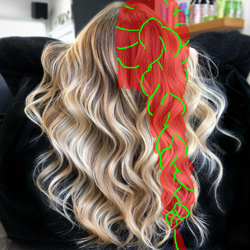 | 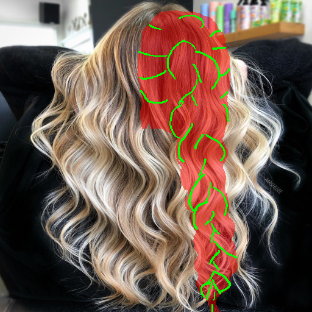 | 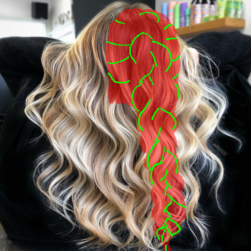 | 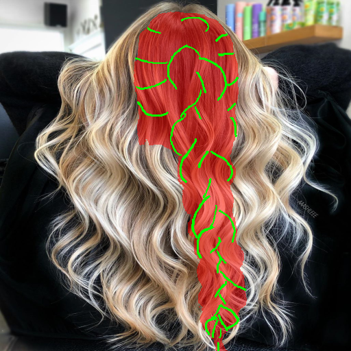 |

## 최종 결과 (Final Results)

| 10\_10\_v2.png | result\_transfer\_ckpt30.png |
| :---: | :---: |
| 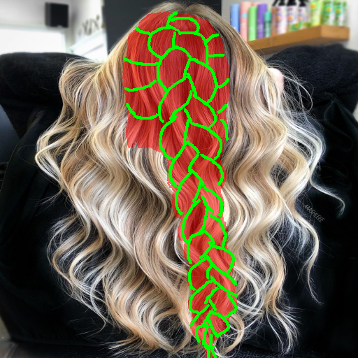 | 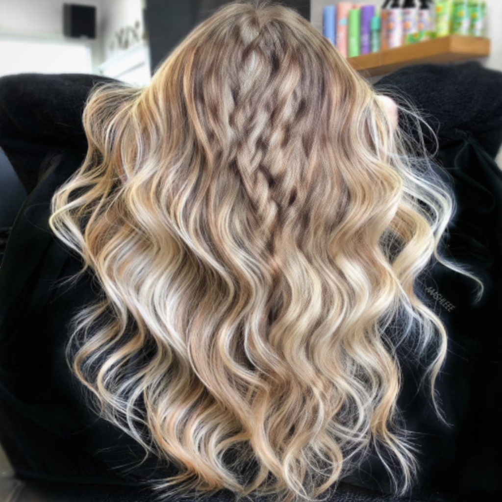 |

| 781\_matte.png | 781\_0\_0.png |
| :---: | :---: |
| 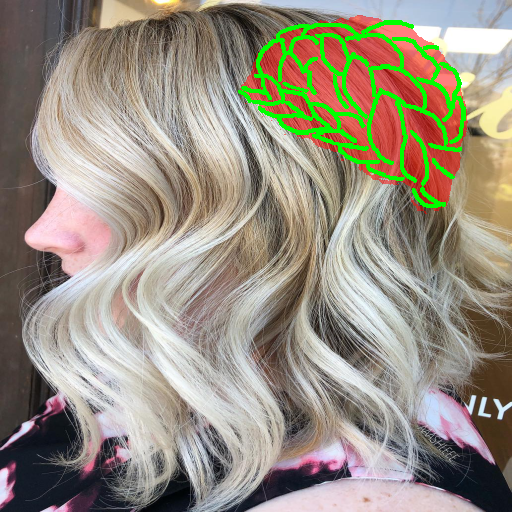 | 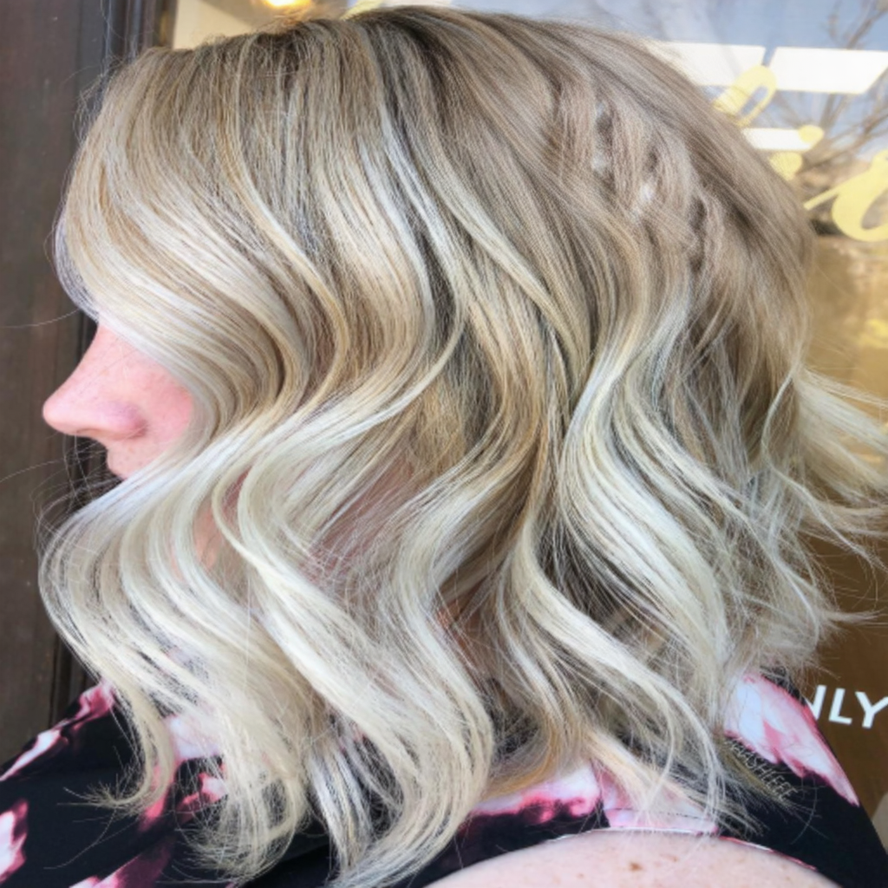 |

---

##  재학습 계획

추론 시의 배경 주입 스케줄링(Background Scheduling)만으로 해결되지 않는 근본적인 'Identity Prior 문제를 해결하기 위한 재학습 전략이 필요.

### 1. 목표: Identity-Style 분리
모델이 "얼굴 모양이 이러니 머리는 이래야 해"라고 판단하는 대신, "얼굴이 누구든 상관없이 스케치 선이 있는 곳에 머리를 그려야 한다"는 절대 규칙을 학습

### 2. 핵심 구현: 데이터 증강 (가장 중요)
`dataset_sd35.py`를 수정하여 학습 과정 중 모델이 이미지를 볼 때마다 **의도적으로 스케치와 원래 얼굴 이미지를 어긋나게** 만듭니다.

- **배경(얼굴/타겟 이미지)**: 변형 없이 제자리에 그대로 둡니다.
- **스케치(Condition) & 마스크(Mask)**: 형태와 영역을 지시하는 이 두 가지는 **항상 똑같은 증강(Augmentation)을 세트로 적용**하여 위치를 비틉니다.
  - **좌우 반전 (Horizontal Flip)**: 랜덤 확률(예: 50%)로 좌우 반전 시킵니다. (모델이 특정 얼굴 방향에 맞는 헤어 스타일에 고착화되는 것을 방지)
  - **회전(Rotation)**: $-15^{\circ} \sim 15^{\circ}$ 사이에서 무작위로 비틉니다.
  - **평행 이동(Translation)**: 상하좌우 무작위로 약간씩 밀어 조절합니다.
- **결과**: 모델은 매번 원래 인물의 얼굴 위치/방향과 전혀 맞지 않는 엉뚱한 스케치를 보게 됩니다. 두상을 참고하려다 실패하는 경험을 반복하면서, 오직 **'스케치 선'**만을 믿고 머리를 그리는 법을 완벽하게 마스터하게 됩니다.

### 3. 학습 프로세스: Joint Training (혼합 학습) 및 구조 보존 가중화
기존의 Stage 1, Stage 2 분리 방식(Curriculum Learning) 대신, 일반 머리(unbraid)와 땋은 머리(braid)를 1:1 비율로 섞어 **한 번에 학습(Joint Training)**합니다.

- **장점**: 모델이 단순한 덩어리(흐름선)와 복잡한 구조(폐쇄된 곡선)를 동시에 번갈아 학습하므로, 특정 스케치 스타일에 편향되지 않고 범용적인 일반화(Generalization) 성능을 갖추며 Catastrophic Forgetting을 방지합니다.
- **필수 보완점 (디테일 뭉개짐 방지)**: 쉬운 데이터(unbraid)에 섞여 땋은 머리의 세밀한 마디(Knot) 형태가 묻히는 것을 막기 위해 다음을 반드시 적용합니다.
  - **구조적 손실 (Structural Loss) 추가**: 형태를 명확히 잡기 위해 원본 이미지와 생성 이미지 간의 경계선을 비교하는 **Pixel-Space Gradient Loss를 학습 목표(Objective)에 명시적으로 추가하여 학습**합니다. (이전 논의에서 채택된 방식)

---

## 📸 결과 비교표 (Visual Comparison)

| 원본 사진 (Target Image) | 스케치 (Sketch) | 이전 결과 (Previous Result) | 현재 결과 (Current Result) |
| :---: | :---: | :---: | :---: |
| 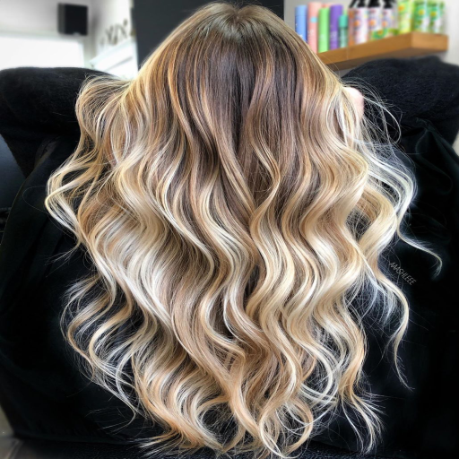 |  | | 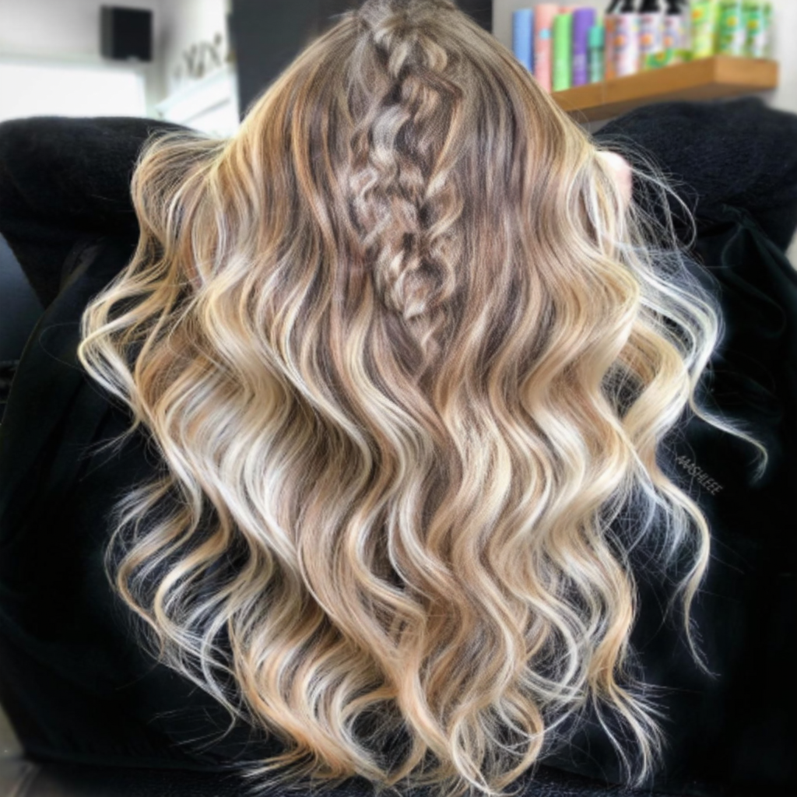 |
| 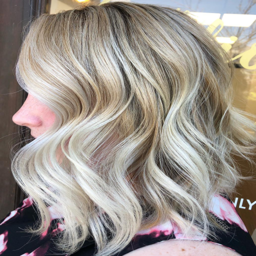 | 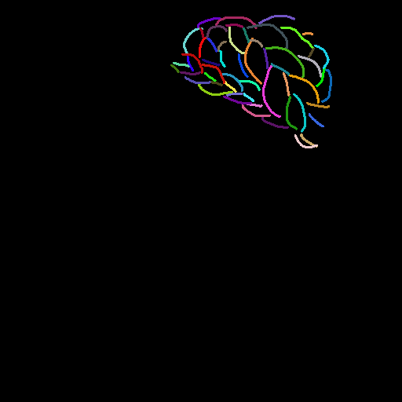 | 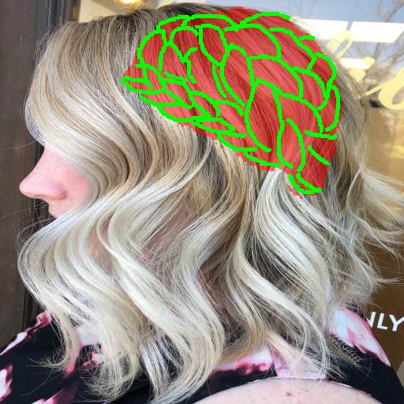| 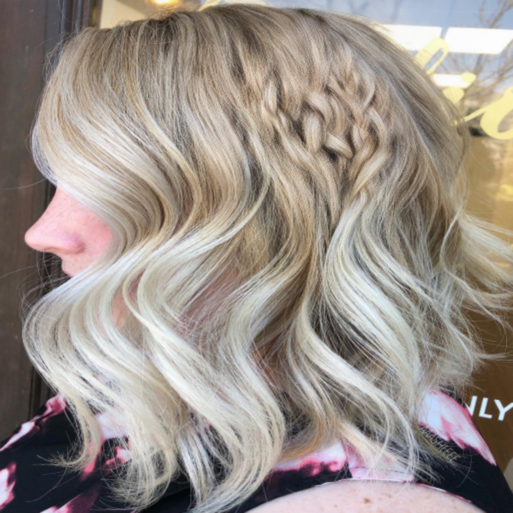 |
